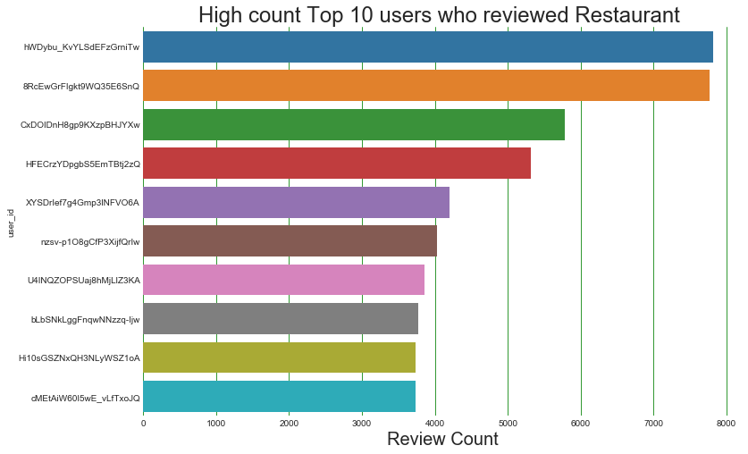

## Contents
{:.no_toc}
*  
{: toc}


As we have large amounf data so we are loading data line by line in dataframe business_df, review_df, user_df


```python
import json

def readjson(filepath):
    data = []
    i=0
    with open(filepath,encoding="utf8") as f:
            for line in f:
                 if i<100000:
                    data.append(json.loads(line))
                    #print(i)
                    i +=1
    return pd.DataFrame(data)

business_df = readjson('./dataset/business.json')
review_df = readjson('./dataset/review.json')
user_df = readjson('./dataset/user.json')
```


Getting reaturants out of business dataframe based on Food category


```python
business_df['categories'] = business_df['categories'].astype(str)
restaurant_df = business_df[business_df['categories'].str.contains('Food')==True]

complete_df = restaurant_df.merge(review_df,on='business_id').merge(user_df,on='user_id')

```


```python
complete_df.head(2)
```


<div>
<style>
    .dataframe thead tr:only-child th {
        text-align: right;
    }

    .dataframe thead th {
        text-align: left;
    }

    .dataframe tbody tr th {
        vertical-align: top;
    }
</style>
<table border="1" class="dataframe">
  <thead>
    <tr style="text-align: right;">
      <th></th>
      <th>address</th>
      <th>attributes</th>
      <th>business_id</th>
      <th>categories</th>
      <th>city</th>
      <th>hours</th>
      <th>is_open</th>
      <th>latitude</th>
      <th>longitude</th>
      <th>name_x</th>
      <th>neighborhood</th>
      <th>postal_code</th>
      <th>review_count_x</th>
      <th>stars_x</th>
      <th>state</th>
      <th>cool_x</th>
      <th>date</th>
      <th>funny_x</th>
      <th>review_id</th>
      <th>stars_y</th>
      <th>text</th>
      <th>useful_x</th>
      <th>user_id</th>
      <th>average_stars</th>
      <th>compliment_cool</th>
      <th>compliment_cute</th>
      <th>compliment_funny</th>
      <th>compliment_hot</th>
      <th>compliment_list</th>
      <th>compliment_more</th>
      <th>compliment_note</th>
      <th>compliment_photos</th>
      <th>compliment_plain</th>
      <th>compliment_profile</th>
      <th>compliment_writer</th>
      <th>cool_y</th>
      <th>elite</th>
      <th>fans</th>
      <th>friends</th>
      <th>funny_y</th>
      <th>name_y</th>
      <th>review_count_y</th>
      <th>useful_y</th>
      <th>yelping_since</th>
    </tr>
  </thead>
  <tbody>
    <tr>
      <th>0</th>
      <td>1203 E Charleston Blvd, Ste 140</td>
      <td>{'BusinessParking': {'validated': False, 'gara...</td>
      <td>YTqtM2WFhcMZGeAGA08Cfg</td>
      <td>['Seafood', 'Restaurants', 'Specialty Food', '...</td>
      <td>Las Vegas</td>
      <td>{'Sunday': '10:15-21:00', 'Wednesday': '10:30-...</td>
      <td>1</td>
      <td>36.159363</td>
      <td>-115.135949</td>
      <td>Mariscos Playa Escondida</td>
      <td>Downtown</td>
      <td>89104</td>
      <td>330</td>
      <td>4.5</td>
      <td>NV</td>
      <td>0</td>
      <td>2016-09-16</td>
      <td>1</td>
      <td>ZH8g_PoY0Tr3YdQ-RGySrA</td>
      <td>5</td>
      <td>Great place. There was a man here who was very...</td>
      <td>1</td>
      <td>EDe16577dBImA1ypOzPlKg</td>
      <td>5.00</td>
      <td>0</td>
      <td>0</td>
      <td>0</td>
      <td>0</td>
      <td>0</td>
      <td>0</td>
      <td>0</td>
      <td>0</td>
      <td>0</td>
      <td>0</td>
      <td>0</td>
      <td>0</td>
      <td>[]</td>
      <td>0</td>
      <td>[]</td>
      <td>0</td>
      <td>Jessica</td>
      <td>1</td>
      <td>0</td>
      <td>2014-07-26</td>
    </tr>
    <tr>
      <th>1</th>
      <td>1203 E Charleston Blvd, Ste 140</td>
      <td>{'BusinessParking': {'validated': False, 'gara...</td>
      <td>YTqtM2WFhcMZGeAGA08Cfg</td>
      <td>['Seafood', 'Restaurants', 'Specialty Food', '...</td>
      <td>Las Vegas</td>
      <td>{'Sunday': '10:15-21:00', 'Wednesday': '10:30-...</td>
      <td>1</td>
      <td>36.159363</td>
      <td>-115.135949</td>
      <td>Mariscos Playa Escondida</td>
      <td>Downtown</td>
      <td>89104</td>
      <td>330</td>
      <td>4.5</td>
      <td>NV</td>
      <td>1</td>
      <td>2014-11-13</td>
      <td>1</td>
      <td>6r2uAJE1dqUq1IHn_3R3qA</td>
      <td>4</td>
      <td>HOT HOT HOT! Real Mexican Food\n\nNO fake wate...</td>
      <td>2</td>
      <td>twx2ZgFUbat87vGQ_tFbPA</td>
      <td>3.55</td>
      <td>0</td>
      <td>0</td>
      <td>0</td>
      <td>2</td>
      <td>0</td>
      <td>1</td>
      <td>3</td>
      <td>0</td>
      <td>5</td>
      <td>0</td>
      <td>0</td>
      <td>11</td>
      <td>[]</td>
      <td>3</td>
      <td>[eFObFWgDiQJwUiy9WlhOfg, W4KL3Q_AVGfRrWcwR60gK...</td>
      <td>29</td>
      <td>Edwin</td>
      <td>94</td>
      <td>317</td>
      <td>2010-12-30</td>
    </tr>
  </tbody>
</table>
</div>


```python
restaurant_df.describe()
```


<div>
<style>
    .dataframe thead tr:only-child th {
        text-align: right;
    }

    .dataframe thead th {
        text-align: left;
    }

    .dataframe tbody tr th {
        vertical-align: top;
    }
</style>
<table border="1" class="dataframe">
  <thead>
    <tr style="text-align: right;">
      <th></th>
      <th>is_open</th>
      <th>latitude</th>
      <th>longitude</th>
      <th>review_count</th>
      <th>stars</th>
    </tr>
  </thead>
  <tbody>
    <tr>
      <th>count</th>
      <td>18503.00000</td>
      <td>18503.000000</td>
      <td>18503.000000</td>
      <td>18503.000000</td>
      <td>18503.000000</td>
    </tr>
    <tr>
      <th>mean</th>
      <td>0.83073</td>
      <td>39.702568</td>
      <td>-87.807760</td>
      <td>34.804464</td>
      <td>3.546857</td>
    </tr>
    <tr>
      <th>std</th>
      <td>0.37500</td>
      <td>5.747548</td>
      <td>27.691971</td>
      <td>82.946472</td>
      <td>0.889710</td>
    </tr>
    <tr>
      <th>min</th>
      <td>0.00000</td>
      <td>-34.520401</td>
      <td>-119.551325</td>
      <td>3.000000</td>
      <td>1.000000</td>
    </tr>
    <tr>
      <th>25%</th>
      <td>1.00000</td>
      <td>35.135615</td>
      <td>-112.013439</td>
      <td>5.000000</td>
      <td>3.000000</td>
    </tr>
    <tr>
      <th>50%</th>
      <td>1.00000</td>
      <td>40.440368</td>
      <td>-81.357777</td>
      <td>11.000000</td>
      <td>3.500000</td>
    </tr>
    <tr>
      <th>75%</th>
      <td>1.00000</td>
      <td>43.665419</td>
      <td>-79.414244</td>
      <td>31.000000</td>
      <td>4.000000</td>
    </tr>
    <tr>
      <th>max</th>
      <td>1.00000</td>
      <td>59.438181</td>
      <td>11.769500</td>
      <td>3439.000000</td>
      <td>5.000000</td>
    </tr>
  </tbody>
</table>
</div>


```python
user_df.describe()
```


<div>
<style>
    .dataframe thead tr:only-child th {
        text-align: right;
    }

    .dataframe thead th {
        text-align: left;
    }

    .dataframe tbody tr th {
        vertical-align: top;
    }
</style>
<table border="1" class="dataframe">
  <thead>
    <tr style="text-align: right;">
      <th></th>
      <th>average_stars</th>
      <th>compliment_cool</th>
      <th>compliment_cute</th>
      <th>compliment_funny</th>
      <th>compliment_hot</th>
      <th>compliment_list</th>
      <th>compliment_more</th>
      <th>compliment_note</th>
      <th>compliment_photos</th>
      <th>compliment_plain</th>
      <th>compliment_profile</th>
      <th>compliment_writer</th>
      <th>cool</th>
      <th>fans</th>
      <th>funny</th>
      <th>review_count</th>
      <th>useful</th>
    </tr>
  </thead>
  <tbody>
    <tr>
      <th>count</th>
      <td>100000.000000</td>
      <td>100000.000000</td>
      <td>100000.000000</td>
      <td>100000.000000</td>
      <td>100000.000000</td>
      <td>100000.000000</td>
      <td>100000.000000</td>
      <td>100000.000000</td>
      <td>100000.000000</td>
      <td>100000.000000</td>
      <td>100000.000000</td>
      <td>100000.000000</td>
      <td>100000.000000</td>
      <td>100000.000000</td>
      <td>100000.000000</td>
      <td>100000.000000</td>
      <td>100000.000000</td>
    </tr>
    <tr>
      <th>mean</th>
      <td>3.729684</td>
      <td>16.342210</td>
      <td>0.950070</td>
      <td>16.342210</td>
      <td>12.015470</td>
      <td>0.416970</td>
      <td>1.465460</td>
      <td>6.980040</td>
      <td>5.491070</td>
      <td>15.870480</td>
      <td>1.046280</td>
      <td>6.151540</td>
      <td>91.215580</td>
      <td>5.103230</td>
      <td>64.731610</td>
      <td>66.524450</td>
      <td>120.838970</td>
    </tr>
    <tr>
      <th>std</th>
      <td>0.835715</td>
      <td>197.424646</td>
      <td>16.639768</td>
      <td>197.424646</td>
      <td>175.458886</td>
      <td>7.165452</td>
      <td>15.762362</td>
      <td>70.410324</td>
      <td>153.225409</td>
      <td>194.113025</td>
      <td>19.474635</td>
      <td>73.883346</td>
      <td>1509.129416</td>
      <td>29.803631</td>
      <td>1049.502721</td>
      <td>178.975429</td>
      <td>1610.123217</td>
    </tr>
    <tr>
      <th>min</th>
      <td>1.000000</td>
      <td>0.000000</td>
      <td>0.000000</td>
      <td>0.000000</td>
      <td>0.000000</td>
      <td>0.000000</td>
      <td>0.000000</td>
      <td>0.000000</td>
      <td>0.000000</td>
      <td>0.000000</td>
      <td>0.000000</td>
      <td>0.000000</td>
      <td>0.000000</td>
      <td>0.000000</td>
      <td>0.000000</td>
      <td>0.000000</td>
      <td>0.000000</td>
    </tr>
    <tr>
      <th>25%</th>
      <td>3.350000</td>
      <td>0.000000</td>
      <td>0.000000</td>
      <td>0.000000</td>
      <td>0.000000</td>
      <td>0.000000</td>
      <td>0.000000</td>
      <td>0.000000</td>
      <td>0.000000</td>
      <td>0.000000</td>
      <td>0.000000</td>
      <td>0.000000</td>
      <td>0.000000</td>
      <td>0.000000</td>
      <td>0.000000</td>
      <td>5.000000</td>
      <td>0.000000</td>
    </tr>
    <tr>
      <th>50%</th>
      <td>3.810000</td>
      <td>0.000000</td>
      <td>0.000000</td>
      <td>0.000000</td>
      <td>0.000000</td>
      <td>0.000000</td>
      <td>0.000000</td>
      <td>0.000000</td>
      <td>0.000000</td>
      <td>0.000000</td>
      <td>0.000000</td>
      <td>0.000000</td>
      <td>0.000000</td>
      <td>0.000000</td>
      <td>0.000000</td>
      <td>16.000000</td>
      <td>2.000000</td>
    </tr>
    <tr>
      <th>75%</th>
      <td>4.240000</td>
      <td>1.000000</td>
      <td>0.000000</td>
      <td>1.000000</td>
      <td>0.000000</td>
      <td>0.000000</td>
      <td>0.000000</td>
      <td>1.000000</td>
      <td>0.000000</td>
      <td>1.000000</td>
      <td>0.000000</td>
      <td>1.000000</td>
      <td>2.000000</td>
      <td>2.000000</td>
      <td>3.000000</td>
      <td>50.000000</td>
      <td>13.000000</td>
    </tr>
    <tr>
      <th>max</th>
      <td>5.000000</td>
      <td>16710.000000</td>
      <td>2146.000000</td>
      <td>16710.000000</td>
      <td>19988.000000</td>
      <td>1265.000000</td>
      <td>1576.000000</td>
      <td>6340.000000</td>
      <td>33297.000000</td>
      <td>13075.000000</td>
      <td>2232.000000</td>
      <td>7117.000000</td>
      <td>175230.000000</td>
      <td>1837.000000</td>
      <td>103514.000000</td>
      <td>11065.000000</td>
      <td>187179.000000</td>
    </tr>
  </tbody>
</table>
</div>


```python
review_df.describe()
```


<div>
<style>
    .dataframe thead tr:only-child th {
        text-align: right;
    }

    .dataframe thead th {
        text-align: left;
    }

    .dataframe tbody tr th {
        vertical-align: top;
    }
</style>
<table border="1" class="dataframe">
  <thead>
    <tr style="text-align: right;">
      <th></th>
      <th>cool</th>
      <th>funny</th>
      <th>stars</th>
      <th>useful</th>
    </tr>
  </thead>
  <tbody>
    <tr>
      <th>count</th>
      <td>100000.000000</td>
      <td>100000.000000</td>
      <td>100000.000000</td>
      <td>100000.00000</td>
    </tr>
    <tr>
      <th>mean</th>
      <td>0.532470</td>
      <td>0.411740</td>
      <td>3.730530</td>
      <td>1.01213</td>
    </tr>
    <tr>
      <th>std</th>
      <td>1.992121</td>
      <td>1.655608</td>
      <td>1.418456</td>
      <td>2.46252</td>
    </tr>
    <tr>
      <th>min</th>
      <td>0.000000</td>
      <td>0.000000</td>
      <td>1.000000</td>
      <td>0.00000</td>
    </tr>
    <tr>
      <th>25%</th>
      <td>0.000000</td>
      <td>0.000000</td>
      <td>3.000000</td>
      <td>0.00000</td>
    </tr>
    <tr>
      <th>50%</th>
      <td>0.000000</td>
      <td>0.000000</td>
      <td>4.000000</td>
      <td>0.00000</td>
    </tr>
    <tr>
      <th>75%</th>
      <td>0.000000</td>
      <td>0.000000</td>
      <td>5.000000</td>
      <td>1.00000</td>
    </tr>
    <tr>
      <th>max</th>
      <td>104.000000</td>
      <td>114.000000</td>
      <td>5.000000</td>
      <td>113.00000</td>
    </tr>
  </tbody>
</table>
</div>


```python
review_df.head(2)
```


<div>
<style>
    .dataframe thead tr:only-child th {
        text-align: right;
    }

    .dataframe thead th {
        text-align: left;
    }

    .dataframe tbody tr th {
        vertical-align: top;
    }
</style>
<table border="1" class="dataframe">
  <thead>
    <tr style="text-align: right;">
      <th></th>
      <th>business_id</th>
      <th>cool</th>
      <th>date</th>
      <th>funny</th>
      <th>review_id</th>
      <th>stars</th>
      <th>text</th>
      <th>useful</th>
      <th>user_id</th>
    </tr>
  </thead>
  <tbody>
    <tr>
      <th>0</th>
      <td>uYHaNptLzDLoV_JZ_MuzUA</td>
      <td>0</td>
      <td>2016-07-12</td>
      <td>0</td>
      <td>VfBHSwC5Vz_pbFluy07i9Q</td>
      <td>5</td>
      <td>My girlfriend and I stayed here for 3 nights a...</td>
      <td>0</td>
      <td>cjpdDjZyprfyDG3RlkVG3w</td>
    </tr>
    <tr>
      <th>1</th>
      <td>uYHaNptLzDLoV_JZ_MuzUA</td>
      <td>0</td>
      <td>2016-10-02</td>
      <td>0</td>
      <td>3zRpneRKDsOPq92tq7ybAA</td>
      <td>3</td>
      <td>If you need an inexpensive place to stay for a...</td>
      <td>0</td>
      <td>bjTcT8Ty4cJZhEOEo01FGA</td>
    </tr>
  </tbody>
</table>
</div>


Performing Exploratory data analysis


```python
sns.pairplot(restaurant_df.iloc[0:10000,:]);
```


## Distribution count of Restaurant rating 
We can see below more restaurants get 4 rating than other ratings


```python
fig, ax = plt.subplots(nrows=1, ncols=1, figsize=(15, 5))

sns.distplot(restaurant_df.stars,kde=False,color = 'g',ax =ax,bins=20);
ax.axvline(restaurant_df.stars.mean(), 0, 1, color='r', label='Mean')
ax.legend();
ax.set_ylabel('Count',size=20)
ax.set_xlabel('Stars',size=20)
ax.set_title('Distribution(count) of Restaurant rating',size=20);
```


## Distribution count of Reviews rating for restaurants 
We can see below more reviews have 5 rating than other ratings


```python
#review just for business which are restautrant
review_df_filter_df = review_df.merge(restaurant_df,how='inner',on='business_id')

fig, ax = plt.subplots(nrows=1, ncols=1, figsize=(15, 5))
sns.distplot(review_df_filter_df.stars_x,kde=False,color = 'g',ax =ax,bins=20);
ax.axvline(review_df_filter_df.stars_x.mean(), 0, 1, color='r', label='Mean')
ax.legend();
ax.set_ylabel('Count',size=20)
ax.set_xlabel('Stars',size=20)
ax.set_title('Distribution(count) of different Reviews rating',size=20)
```


    Text(0.5,1,'Distribution(count) of different Reviews rating')


## Distribution count of user rating for restaurants 
We can see below  users have around mean of 3.7  rating


```python
#user just for business which are restautrant
user_df_filter_df = complete_df.groupby(['user_id'],as_index=False).mean()

fig, ax = plt.subplots(nrows=1, ncols=1, figsize=(15, 5))
sns.distplot(user_df_filter_df.average_stars,kde=False,color = 'g',ax =ax,bins=20);
ax.axvline(user_df_filter_df.average_stars.mean(), 0, 1, color='r', label='Mean')
ax.legend();
ax.set_ylabel('Count',size=20)
ax.set_xlabel('Stars',size=20)
ax.set_title('Distribution(count) of User given rating',size=20)

#fig.tight_layout()
```


    Text(0.5,1,'Distribution(count) of User given rating')


## Scatter plot various features 
We can see that useful, funny and cool are correlated 


```python
sns.pairplot(review_df_filter_df.iloc[0:10000,:]);

```


## Most Reviewed Restaurant
Bouchon at the Venezia Tower is reviewed almost double as compared to others


```python
#get top 20 most reviewed restaurants
n_top =20
most_reviewed_restaurant = restaurant_df.nlargest(n_top, 'review_count')
fig, ax = plt.subplots()
ax = sns.barplot(y="name", x="review_count", data=most_reviewed_restaurant)
ax.set_xlabel('Review Count',size=20)
fig.set_size_inches(12, 8)
plt.title("Most Reviewed Restaurant",fontsize=24);
ax.grid(axis = 'x', color ='green', linestyle='-')
ax.tick_params(axis='both', which='both',length=0)
sns.despine(left=True, bottom=True)

```


## Top 10 5 star rated Restaurant
Poke Express is the top 5 star rated restaurant


```python
top_rated_restaurant = restaurant_df.sort_values(by=['stars','review_count'],
                                                 ascending=False)[['name','business_id','review_count','stars']]
#get top 10 5 star rated restaurant
n_top =10
top_rated_restaurant = top_rated_restaurant.nlargest(n_top, 'stars')
fig, ax = plt.subplots()
ax = sns.barplot(y="name", x="review_count", data=top_rated_restaurant)
ax.set_xlabel('Count',size=20)
fig.set_size_inches(12, 8)
plt.title("Top 10 5 star rated Restaurant",fontsize=24);
ax.grid(axis = 'x', color ='green', linestyle='-')
ax.tick_params(axis='both', which='both',length=0)
sns.despine(left=True, bottom=True)
```


Getting different food categories from the restaurant dataframe


```python
top_rated_restaurant = restaurant_df.sort_values(by=['stars','review_count'],
                                                 ascending=False)[['name','business_id','review_count','stars']]
#top_rated_restaurant
```


```python
def get_food_type_count(category):
    count = restaurant_df[restaurant_df['categories'].str.contains(category)==True]['business_id'].count()
    return count

```


```python
food_dict = {}
food_categories = ['American','Italian','Mexican','Chinese','Thai','Indian','Japan','French']
for food_category in food_categories:
    food_dict[food_category] = get_food_type_count(food_category)
    

```


## Distribution of review count with respect to Food Categories
We can see American restaurant have higher count of reviews followed by Mexican


```python
plt.figure(figsize=(20,10))
plt.bar(range(len(food_dict)), food_dict.values(), align='center',color='forestgreen')
plt.xticks(range(len(food_dict)), list(food_dict.keys()),fontsize = 15);
plt.title('Distribution of review count with respect to Food Categories',fontsize=18)
plt.xlabel('Food Category',fontsize=18)
plt.ylabel('Count',fontsize=18)

```


    Text(0,0.5,'Count')


## Distribution(count) of American, Mexican, Italian, Chinese Restaurant rating
We can see American and Italian restaurants are rated higher than other restaurants


```python
American_restaurant_rating_df = restaurant_df[restaurant_df['categories'].str.contains('American')==True][['business_id','stars','categories','name','review_count']]
Mexican_restaurant_rating_df = restaurant_df[restaurant_df['categories'].str.contains('Mexican')==True][['business_id','stars','categories','name','review_count']]
Chinese_restaurant_rating_df = restaurant_df[restaurant_df['categories'].str.contains('Chinese')==True][['business_id','stars','categories','name','review_count']]
Italian_restaurant_rating_df = restaurant_df[restaurant_df['categories'].str.contains('Italian')==True][['business_id','stars','categories','name','review_count']]

fig, ax = plt.subplots(nrows=2, ncols=2, figsize=(15, 8))
ax = ax.ravel()

def restaurant_category(df, title, ax):

    sns.distplot(df.stars,kde=False,color = 'g',ax =ax,bins=20);
    ax.axvline(df.stars.mean(), 0, 1, color='r', label='Mean')
    ax.legend();
    ax.set_ylabel('Count',size=20)
    ax.set_xlabel('Stars',size=20)
    ax.set_title('Distribution(count) of '+ title + ' Restaurant rating',size=20);

restaurant_category(American_restaurant_rating_df, 'American', ax[0])
restaurant_category(Mexican_restaurant_rating_df, 'Mexican', ax[1])
restaurant_category(Chinese_restaurant_rating_df, 'Chinese', ax[2])
restaurant_category(Italian_restaurant_rating_df, 'Italian', ax[3])

plt.tight_layout()
```


```python
American_restaurant_rating_df.head(2)
```


<div>
<style>
    .dataframe thead tr:only-child th {
        text-align: right;
    }

    .dataframe thead th {
        text-align: left;
    }

    .dataframe tbody tr th {
        vertical-align: top;
    }
</style>
<table border="1" class="dataframe">
  <thead>
    <tr style="text-align: right;">
      <th></th>
      <th>business_id</th>
      <th>stars</th>
      <th>categories</th>
      <th>name</th>
      <th>review_count</th>
    </tr>
  </thead>
  <tbody>
    <tr>
      <th>34</th>
      <td>reWc1g65PNZnKz_Ub9QKOQ</td>
      <td>2.5</td>
      <td>['Comfort Food', 'Canadian (New)', 'Restaurant...</td>
      <td>Milestones Restaurants</td>
      <td>51</td>
    </tr>
    <tr>
      <th>55</th>
      <td>Z1r6b30Tg0n0ME4-Zj2wQQ</td>
      <td>3.0</td>
      <td>['American (Traditional)', 'Restaurants', 'Bar...</td>
      <td>Boardwalk Place</td>
      <td>13</td>
    </tr>
  </tbody>
</table>
</div>


## Top 20 American 5 star rated Restaurant


```python
American_top_rated_restaurant = American_restaurant_rating_df.sort_values(by=['stars','review_count'],
                                                 ascending=False)[['name','business_id','review_count','stars']]
#get top 20 5 star rated restaurant
n_top =20
American_top_rated_restaurant = American_top_rated_restaurant.nlargest(n_top, 'stars')
fig, ax = plt.subplots()
ax = sns.barplot(y="name", x="review_count", data=American_top_rated_restaurant)
ax.set_xlabel('Count',size=20)
fig.set_size_inches(12, 8)
plt.title("Top 20 American 5 star rated Restaurant",fontsize=24);
ax.grid(axis = 'x', color ='green', linestyle='-')
ax.tick_params(axis='both', which='both',length=0)
sns.despine(left=True, bottom=True)
```


## High-count Top 10 users who reviewed Restaurant


```python

#get top 10 most reviewing users
n_top =10
most_review_user = user_df_filter_df.nlargest(n_top, 'review_count_y').reindex()
fig, ax = plt.subplots()
ax = sns.barplot(y="user_id", x="review_count_y", data=most_review_user)
ax.set_xlabel('Review Count',size=20)
fig.set_size_inches(12, 8)
plt.title("High count Top 10 users who reviewed Restaurant ",fontsize=24);
ax.grid(axis = 'x', color ='green', linestyle='-')
ax.tick_params(axis='both', which='both',length=0)
sns.despine(left=True, bottom=True)

```





## Distribution of Review Count given by users and given to Restaurant
We can see that most review count is with less number of users and restaurants


```python
fig, ax = plt.subplots(nrows=1, ncols=2, figsize=(15, 8))
user_df_filter_df.review_count_y.hist(bins=400,ax=ax[0],color = 'g')
#plt.xlim([0,1000])
ax[0].legend();
ax[0].set_xlim([0,1000])
ax[0].set_ylabel('Review Count',size=20)
ax[0].set_xlabel('Num of Users',size=20)
ax[0].set_title('Distribution of Review Count given by User',size=20);

restaurant_df.review_count.hist(bins=400,ax=ax[1],color = 'g')
ax[1].set_xlim([0,300])
ax[1].legend();
ax[1].set_ylabel('Review Count',size=20)
ax[1].set_xlabel('Num of Restaurant',size=20)
ax[1].set_title('Distribution of Review Count given to Restaurant',size=20);

```


